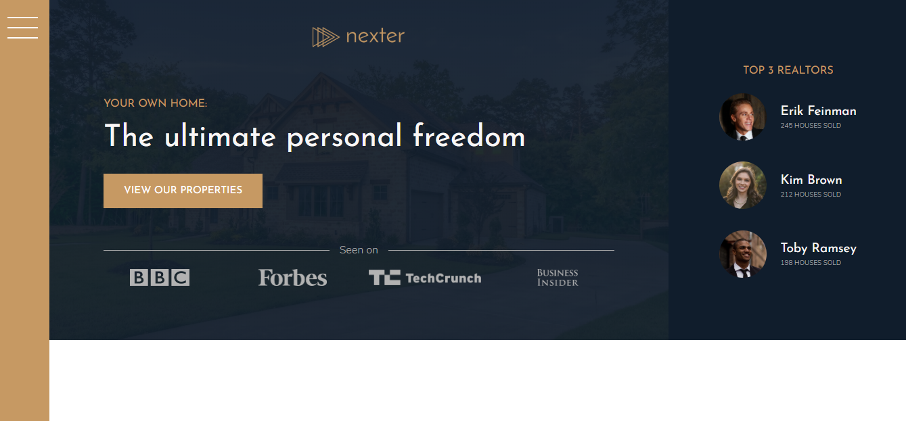

# Nexter Project

Project build mainly with HTML and CSS with the pre-processor SASS where I built the main webpage of a fictitious real state company for luxury houses called Nexter, following the guide in the Udemy course "Advanced CSS and Sass: Flexbox, Grid, Animations and More!" created by Jonas Schmedtmann.

<!--  -->

## Built With
- HTML
- CSS
- autoprefixer
- concat
- node-sass
- npm-run-all
- postcss-cli

## Authors

- 👤GitHub: [Jose Abel Ramirez](https://github.com/jose-Abel)

## Getting Started
You can clone this code anytime and load the HTML on your browser.

## Live version
Soon

### Setup
You can either copy the code with git clone or just do a git pull on your local environment. Since the sass files are already compiled to CSS doesn't need to do anything else.

### Acknowledgments
Appreciate the teams at Udemy and the creator of the course Jonas Schmedtmann since allows me to learn a lot of CSS and Sass concepts and design principles that is pushing my software development career higher.

## 📝 License
This project is MIT licensed.

## Show your support
Give a ⭐️ if you like this project!